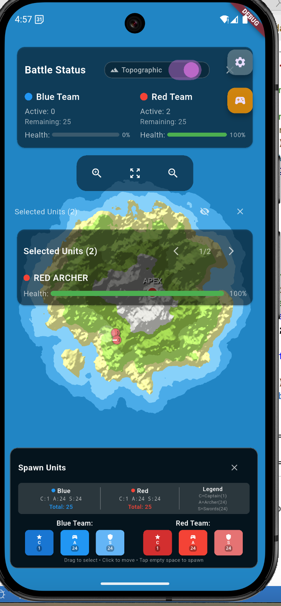

# Atoll Attack - Island Conquest RTS

A real-time strategy game where players battle for control of procedurally generated islands. Command your units, capture strategic positions, and plant your flag at the island's apex to claim victory!

## 🎮 Game Overview

Atoll Attack is a mobile-first RTS game featuring:

- **Procedurally generated islands** with unique terrain and elevation
- **Three unit types**: Captains (flag bearers), Archers (ranged), and Swordsmen (melee)
- **Strategic gameplay**: Use terrain elevation for tactical advantages
- **Quick battles**: 5-10 minute matches perfect for mobile play
- **Touch-optimized controls**: Drag to select, tap to move, pinch to zoom
- **Real-time multiplayer**: Host/join games with instant synchronization

## 🏗️ Current Architecture

### Multiplayer System ✅ **COMPLETED**

**Invite-Based Multiplayer** - No lobby required, just share room codes!

#### How It Works:
1. **Host Game**: Create a room with unique code (e.g., "ABC123")
2. **Share Code**: Send room code via any messaging app
3. **Join Game**: Enter room code to join instantly
4. **Real-time Play**: WebRTC + Firebase RTDB for low-latency synchronization

#### Technical Implementation:
- **WebRTC (Primary)**: Direct peer-to-peer for ultra-low latency (~10-50ms)
- **Firebase RTDB (Fallback)**: Reliable server-based sync (~50-100ms)
- **Hybrid Command System**: Automatic failover ensures 100% delivery
- **Team Assignment**: Host = Blue team, Guest = Red team
- **Cross-platform**: Works between emulators and real devices

### Core Components

- **UnitModel**: Individual unit data with player ownership
- **ShipComponent**: Naval units for unit deployment with contextual spawn controls
- **IslandComponent**: Procedural terrain generation with GPU shaders
- **CombatRules**: Deterministic combat calculations
- **GameCommandManager**: Multiplayer command synchronization
- **UnitSelectionManager**: Touch-based unit selection and movement

### Key Features Implemented

- ✅ **Real-time multiplayer** with WebRTC + Firebase RTDB
- ✅ **Host/Join system** with room codes
- ✅ **Ship movement** - Drag ships to new positions
- ✅ **Unit spawning** - Long-tap ships for contextual spawn controls
- ✅ **Team-based gameplay** - Blue vs Red with ownership validation
- ✅ **Cross-device sync** - Commands replicated instantly
- ✅ **Touch controls** - Drag-to-select, tap-to-move, long-tap-to-spawn
- ✅ **Procedural island generation** with elevation-based gameplay
- ✅ **Responsive UI scaling** for different screen sizes
- ✅ **Deep link infrastructure** for easy game sharing
- ✅ **Ship boarding & healing system** for strategic unit management

## 🎯 Completed Development Phases

### ✅ Phase 1: Deep Link Infrastructure
- Asset links & universal links configured
- Cloud Function redirect endpoint at `/i/{code}`
- App Links handling in Flutter via `app_links` package

### ✅ Phase 2: Game Session Management
- ✅ Create game rooms with unique codes
- ✅ Implement host/guest states with team assignment
- ✅ Add automatic reconnection functionality
- ✅ Room-based multiplayer with WebRTC signaling

### ✅ Phase 3: Real-time Synchronization
- ✅ Hybrid WebRTC + Firebase RTDB command system
- ✅ Client-side prediction with server reconciliation
- ✅ Command deduplication and ownership validation
- ✅ Cross-device coordinate synchronization

## 🎮 How to Play

### Single Player
1. Launch the game
2. Use touch controls to move ships and spawn units
3. Long-tap ships to access spawn controls

### Multiplayer
1. **Host**: Tap "Host" button → Share room code with friend
2. **Join**: Tap "Join" button → Enter room code
3. **Play**: Host controls blue team, guest controls red team
4. **Controls**: 
   - **Ship movement**: Tap and drag ships
   - **Unit spawning**: Long-tap ships → Select unit type
   - **Team colors**: Blue (host) vs Red (guest)

## 🛠️ Technical Stack

- **Frontend**: Flutter + Flame Engine
- **Multiplayer**: WebRTC (primary) + Firebase RTDB (fallback)
- **Deep Links**: Firebase Hosting + Cloud Functions
- **Backend**: Firebase Firestore + Cloud Functions
- **Analytics**: Firebase Analytics
- **Crash Reporting**: Firebase Crashlytics

## 🚀 Development Roadmap

### ✅ Completed Phases

#### Phase 1: Deep Link Infrastructure ✅
- Asset links & universal links configured
- Cloud Function redirect endpoint at `/i/{code}`
- App Links handling in Flutter via `app_links` package

#### Phase 2: Game Session Management ✅
- Create game rooms with unique codes
- Implement host/guest states with team assignment
- Add automatic reconnection functionality
- Room-based multiplayer with WebRTC signaling

#### Phase 3: Real-time Synchronization ✅
- Hybrid WebRTC + Firebase RTDB command system
- Client-side prediction with server reconciliation
- Command deduplication and ownership validation
- Cross-device coordinate synchronization

### 🚧 Current Development Phases

#### Phase 4: Naval Battle System 🚢
**Beta Player Requested Feature**
- **Ship-to-Ship Combat**: Cannons and broadside attacks
- **Naval Engagement Zones**: Open water combat areas
- **Ship Health & Damage**: Durability and destruction mechanics
- **Archer Support**: Units on ships can engage enemy vessels
- **Strategic Positioning**: Angle ships for optimal cannon fire
- **Landing vs Combat**: Choose between naval battle or quick landing

#### Phase 5: Enhanced Combat & Victory System ⚔️
- Advanced unit vs unit combat mechanics
- Flag capture victory conditions with naval support
- Elimination-based win conditions
- Combat animations and naval battle effects
- Ship repair and maintenance systems

#### Phase 6: AI Player System 🤖
- **Single-player vs AI**: Computer opponent for practice
- **Multiple Difficulty Levels**: Easy, Medium, Hard AI
- **Naval AI Tactics**: AI ship positioning and combat
- **Strategic Decision Making**: AI resource management
- **Adaptive Behavior**: AI responds to player strategies

#### Phase 7: Game Polish & Balance ✨
- Unit costs and deployment cooldowns
- Naval combat balancing and ship upgrades
- Sound effects and music (including naval battle audio)
- Particle effects and animations
- Tutorial system covering naval and land combat
- Performance optimization

#### Phase 8: Social Features 🏆
- Victory sharing and replays (including naval battles)
- Player statistics and naval combat records
- Leaderboards for different game modes
- Achievement system
- Spectator mode for ongoing battles
- Achievement system

## 🔧 Development Setup

```bash
# Install dependencies
flutter pub get

# Run on device
flutter run

# Build for release
flutter build apk  # Android
flutter build ios  # iOS
```

## 📱 Platform Support

- iOS 12.0+
- Android 6.0+ (API 23+)
- Optimized for phones (tablet support planned)
- Full landscape/portrait orientation support

## 🎯 Design Philosophy

Atoll Attack is designed as a "snackable" RTS—quick matches you can play with friends during a coffee break. The invite system removes friction: no accounts, no lobbies, just "share code and play." Every island is unique, making each battle memorable and shareable.

## 🤝 Contributing

This is currently a solo project, but contributions are welcome! Please check the issues tab for areas where help is needed.

## 📸 Screenshot



## 📄 License

MIT License - see [LICENSE](LICENSE) file for details

---

*Atoll Attack - Where islands become battlefields and friends become rivals!*

**🎉 Multiplayer RTS Game - Now Playable! 🎉**
